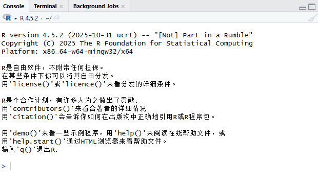
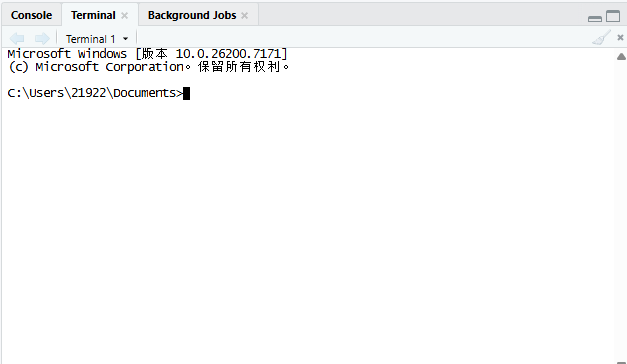
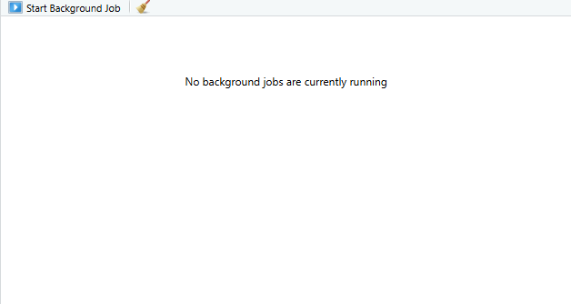
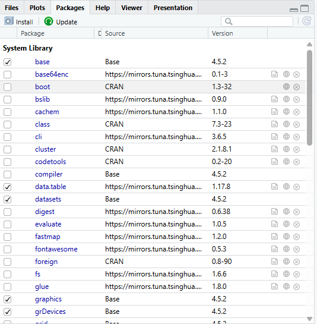
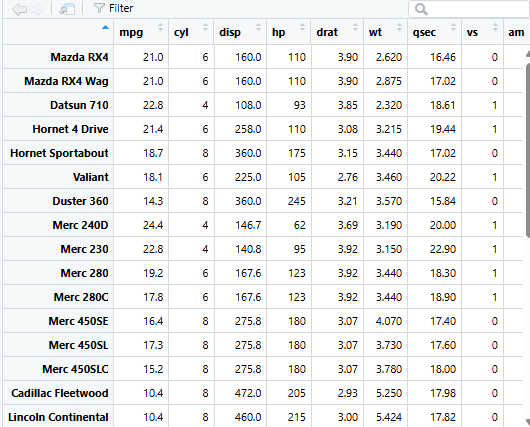
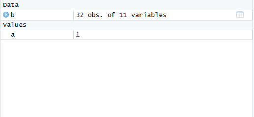

1.运行单行代码 ctrl+enter或者使用run按钮 运行多行代码也可以先选中在使用ctrl+enter 运行整个代码块 ctrl+shift+enter

2\. 

3.install.packages()函数下载package 

4.用library()函数导入

5.下次打开不需要重新安装但是需要重新导入

6.赋值可以用\<-也可以用=但不建议用= 赋值快捷键Alt+- 

7\.

8.在语句后方加#号 或者使用快捷键Ctrl + Shift + C
